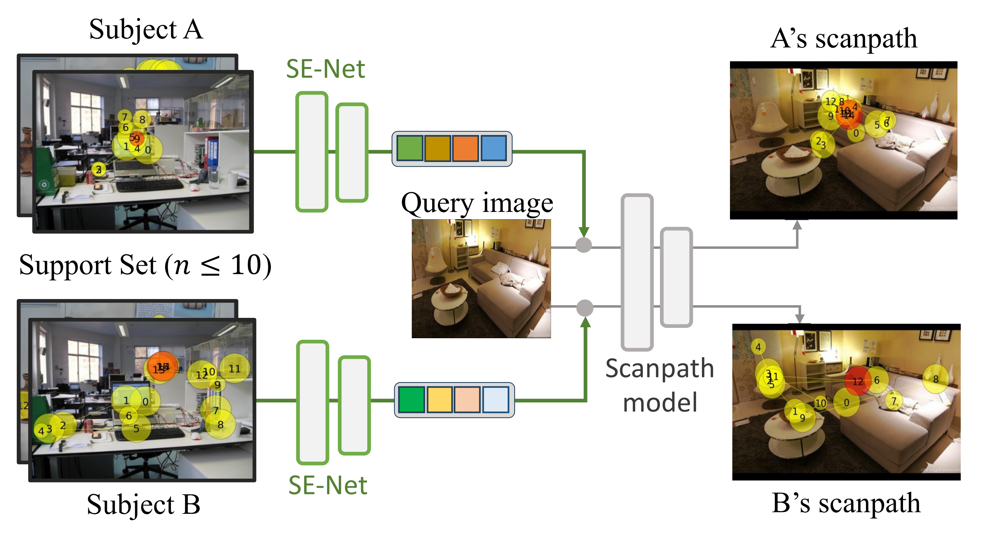
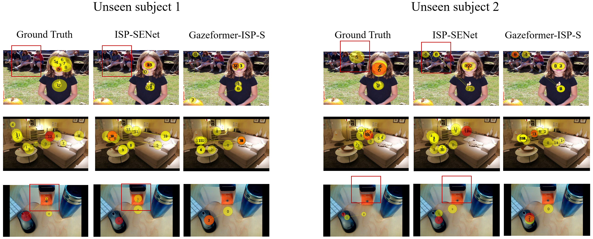

# Few-shot Personalized Scanpath Prediction

Official code for CVPR 2025 paper "Few-shot Personalized Scanpath Prediction"

Please contact Ruoyu Xue (ruoxue@cs.stonybrook.edu) for any inquiries. Thanks!

#### Abstract

A personalized model for scanpath prediction provides insights into the visual preferences and attention patterns of individual subjects. However, existing methods for training scanpath prediction models are data-intensive and cannot be effectively personalized to new individuals with only a few available examples. In this paper, we propose few-shot personalized scanapth prediction task (FS-PSP) and a novel method to address it, which aims to predict scanpaths for an unseen subject using minimal support data of that subject's scanpath behavior. The key to our method's adaptability is the Subject-Embedding Network (SE-Net), specifically designed to capture unique, individualized representations for each user's scanpaths. SE-Net generates subject embeddings that effectively distinguish between subjects while minimizing variability among scanpaths from the same individual. The personalized scanpath prediction model is then conditioned on these subject embeddings to produce accurate, personalized results. Experiments on multiple eye-tracking datasets demonstrate that our method excels in FS-PSP settings and does not require any fine-tuning steps at test time.



#### Results


The three rows show examples from OSIE, COCO-FreeView, and COCO-Search18, respectively. The first row demonstrates that ISP-SENet can distinguish different subject interests in peripheral objects. The second row shows that ISP-SENet can capture variations in fixation patterns, such as centralized versus scattered distributions. The third row illustrates that ISP-SENet can differentiate subjects who are distracted by peripheral objects during target search.

#### Code
 - ISP-SENet supports OSIE, COCO-FreeView, COCO-Search18, and the local Air-D/AiR path.
 - For SE-Net implementation, go to SE-Net folder.
 - For ISP implementation, go to ISP folder for environment setup and data prepration, go to ISP/<dataset_name>/GazeformerISP for detailed implementation on each dataset. 


#### Acknowledgement

[1] Zhibo Yang, Sounak Mondal, Seoyoung Ahn, Ruoyu Xue, Gregory Zelinsky, Minh Hoai, and Dimitris Samaras. Unifying top-down and bottom-up scanpath prediction using transformers. CVPR 2024.

[2] Xianyu Chen, Ming Jiang, and Qi Zhao. Beyond average: Individualized visual scanpath prediction. CVPR 2024.


#### Reference
Please cite if you use this code base.

```bibtex
@inproceedings{xue2025few,
  title={Few-shot Personalized Scanpath Prediction},
  author={Xue, Ruoyu and Xu, Jingyi and Mondal, Sounak and Le, Hieu and Zelinsky, Greg and Hoai, Minh and Samaras, Dimitris},
  booktitle={Proceedings of the Computer Vision and Pattern Recognition Conference},
  pages={13497--13507},
  year={2025}
}

```

### Optional hierarchical explanations and Air-D

The explanation branch is opt-in (`--enable_explanation`); ordinary scanpath
training/inference does not load a semantic encoder, tokenizer, or causal LLM.
Enabled supervised runs require real task/question text and complete WHAT,
WHY-region, and HOW targets, inline under `prediction` or in a uniquely matched
sidecar. Set `--semantic_encoder_name` and `--explanation_llm_name` explicitly;
use the freeze flags when those networks should not be trained. The hierarchy is
continuous `decoder -> fixation -> soft episodes -> active-slot mean -> global`,
not a chain of generated sentences. Loss weights remain individually configurable.

See `ISP/AiR/GazeformerISP/README.md` for Air-D data, train/test, and checkpoint
contracts. See `audit/AUDIT_REPORT.md` for verification boundaries and external
prerequisites. Run the offline CPU contract tests from this directory with
`python -m pytest -q tests`. Passing synthetic tests is not a dataset-scale or
published-metric reproduction claim.
